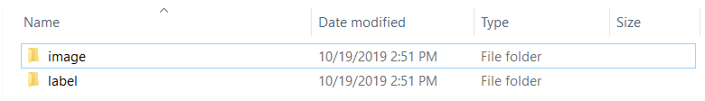
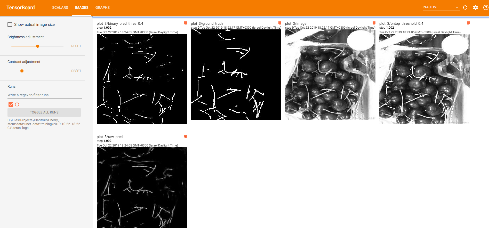
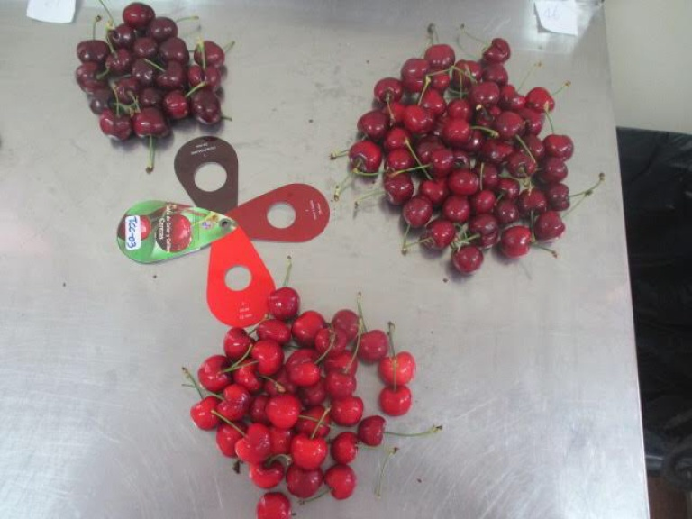
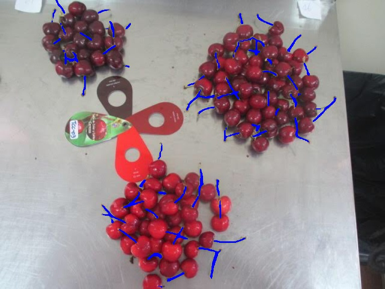
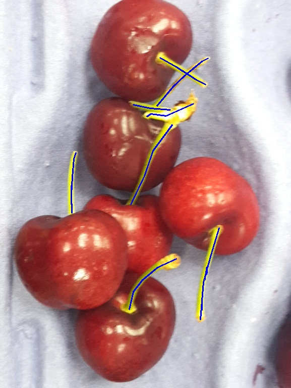
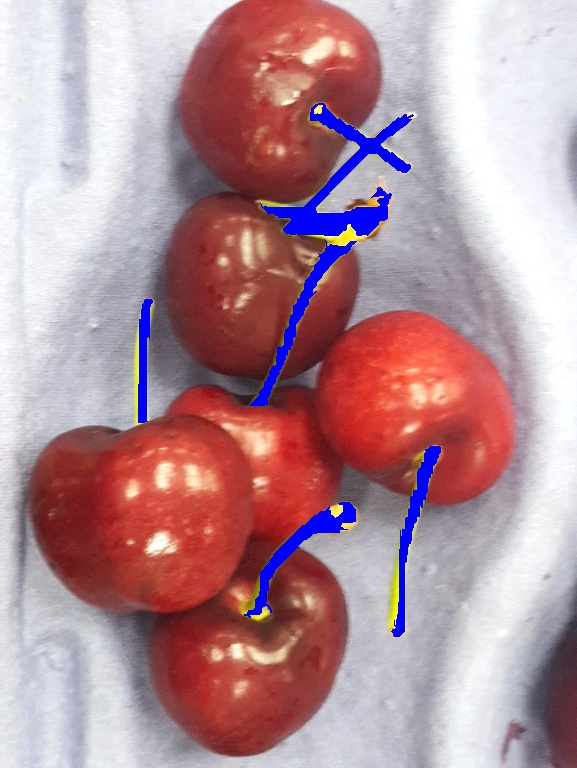
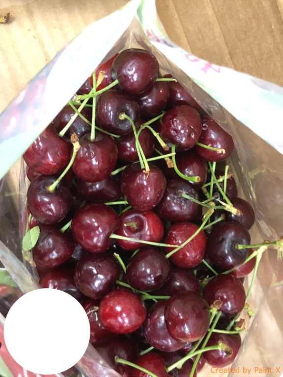
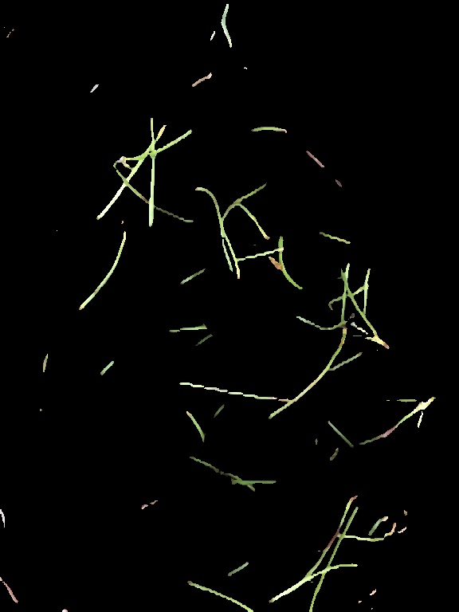

# Clarifruit Unet

A framework for experimenting with semantic Segmentation using 
[U-Net: Convolutional Networks for Biomedical Image Segmentation](https://arxiv.org/abs/1505.04597) and
performing color based classification on the resulting masks.
Used in this instance to perform semantic segmentation on images of cherries to
isolate the stems and classify the images into 4 quality levels after
transforming the maskes into hsv color space histograms and using them with an
Xgboost algorithm for final classification.
Part of my internship at Clarifruit


## Status  
<b>Incomplete</b>
 - need to work on some functions in stem extraction
 - need to add tests
 - need to complete prediction pipeline
 - need to finish stem classifier
 - need to review the notebooks

## Getting Started


### Prerequisites

Installed python 3

### Installing

Install venv requirments from requirements.txt
first create a new Virtual Environment in the same
folder containing the "Work" folder
```
py -m venv venv
```
activate the Environment:
```
venv\Scripts\activate
```
and than use pip install:
```
pip install -r requirements.txt
```
## Overview

### Data
Used on an private data set, unavailable at the moment
but in order to use the framework, the data set must have a root
folder containing one folder the images, and another for the segmentation masks
e.g


### Unet

Using a slightly modified implementation from https://github.com/zhixuhao/unet

#### Data augmentation
Using the options of the keras ImageDataGenerator augmentations.
e.g 
```
ImageDataGenerator(rotation_range=180,
                   brightness_range=[0.2, 1.],
                   shear_range=5,
                   zoom_range=0.5,
                   horizontal_flip=True,
                   vertical_flip=True,
                   fill_mode='nearest')
```

#### Usage

For an example on usage see the model_training notebook
for direct usage open the work/unet_debug_main.py and modify the parameters

Another options is to create a json file 
(see example_data/example.json) and run the following command:

```
py cli_main.py train_unet --params_dict_path {PATH TO JSON FILE}
```

##### Tensorboard
The framework save tfrecords files for visualizations with tensorboard.
In the  model_training notebook it one of the cells outputs a string a such:
```
tensorboard --logdir=D:\Files\Projects\Clarifruit\Cherry_stem\data\unet_data\training\2019-10-22_18-22-04\keras_logs
```
which can be used to activate tensorboard:  



#### Results
Source image:  
  
marked stems:  



## Segmentation Augmentation

Also implemented is an approach to augment the given\ resulting segmentation
masks using Computer Vision algorithems, such as [felzenszwalb](http://people.cs.uchicago.edu/~pff/papers/seg-ijcv.pdf)
implemented with the [skimage module](https://scikit-image.org/docs/dev/api/skimage.segmentation.html#skimage.segmentation.felzenszwalb),

### Usage
for direct usage open the work/segmentation_main.py and modify the parameters

### Results
before:  
  
after:  
  

## Classification
The segmentation masks are used to extract the "stems" of the cherries,
which are converted to hsv histograms which are used as input to an [Xgboost](https://xgboost.readthedocs.io/en/latest/) 
classifier (on a new train test data) which results in ranked classification  

### Usage
For this part the test and train data should be source images that are separted 
into classes, i.e each class has its own folder:  
<pre>
        | - A            | - A  
        | - B            | - B  
train --| - C    test -- | - C    
        | - D            | - D 
</pre>

First create the hsv results for test and train,

```
create_test_train_obj(ground_path=<PATH TO FOLDER WITH TEST AND TRAIN>,
                      threshold=<THRESHOLD TO CREATE BINARY MASK>,
                      src_path= <PATH TO UNET RESULTS>,
                      hist_type=<'hsv' or 'bgr', the type of histogram>,
                      obj_type=<can create other objects other than\
                                histograms, see documentation>)
```

than create hsv for model predictions using  stem_extract.py\create_object

### Results
An Example:  
  
after:  
  

 initial classification Results:  
 
 |              | precision | recall | f1-score | support |
|--------------|-----------|--------|----------|---------|
| A            | 0.78      | 0.87   | 0.83     | 79      |
| B            | 0.65      | 0.62   | 0.64     | 55      |
| C            | 0.80      | 0.23   | 0.36     | 35      |
| D            | 0.68      | 0.96   | 0.80     | 47      |
| accuracy     |           |        | 0.72     | 216     |
| macro avg    | 0.73      | 0.67   | 0.65     | 216     |
| weighted avg | 0.73      | 0.72   | 0.69     | 216     |
 

## License  

This project is licensed under the MIT License - see the [LICENSE.md](LICENSE.md) file for details


## Acknowledgments

* Mentoring and guidance [Roman Mirochnik](https://www.linkedin.com/in/mrroman/)

